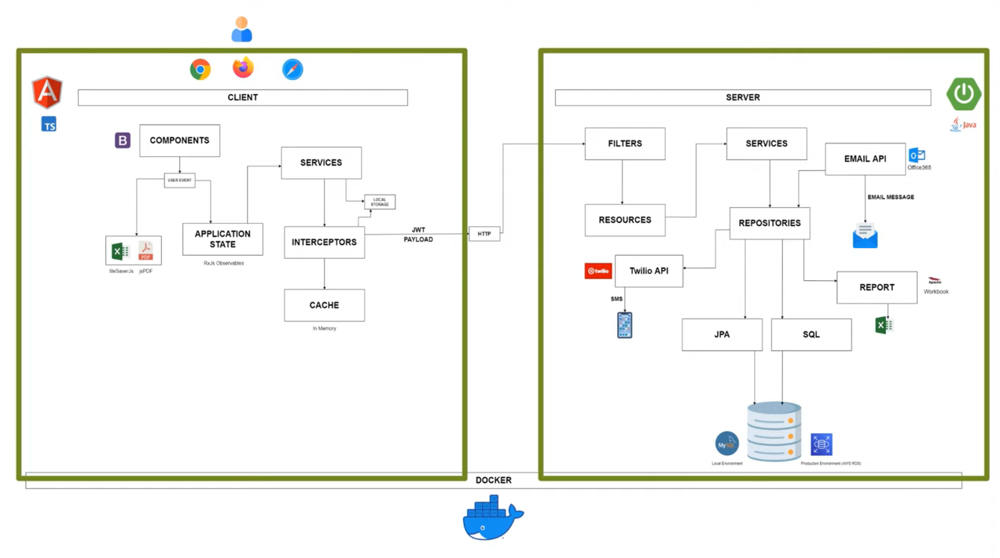

# FlowInvoice  
An invoice tracking fullstack application that will utilize Angular and Spring Boot

## Goal
My goal is to develop a better understanding of Angular, Spring Boot, and Maven (along with all of the other tools/services that will come along with the project).

## Structure
<!-- Image of the diagram -->

  

## Credit

* [Kevin Dang](https://github.com/kevinthedang/)

[Tutorial](https://www.youtube.com/watch?v=tX7t45m-4H8)